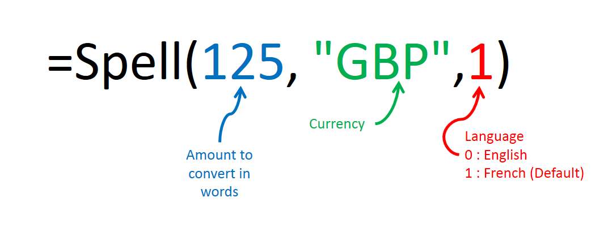
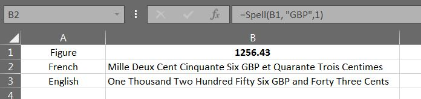

# Figure_to_MultiLingual_Words_Currency
VBA Macro is developed to 'spell the Amount'.

## How to use?

***Sample***

## Current Consideration
1. Currently, Tow Languages are taken for conversion, but can be exteded to multiple languages. (by including into *Sub SpellWords()*, *Sub Seprators()* and *Sub Misc()*)
2. Conversion is considered upto 999 French-Billion. This can be extended. (by including into *Sub Seprators()*)
3. Considered 2 decimal fraction value & rounding off by floor value
4. "Un" is used incase of One, Million, Milliard or Billion
5. Livre Sterling/Pound has Pense decimal.
6. Function has default French conversion in case language not set

### Note
This function, for converting figure to words, can be use into javascript, python etc, too.
